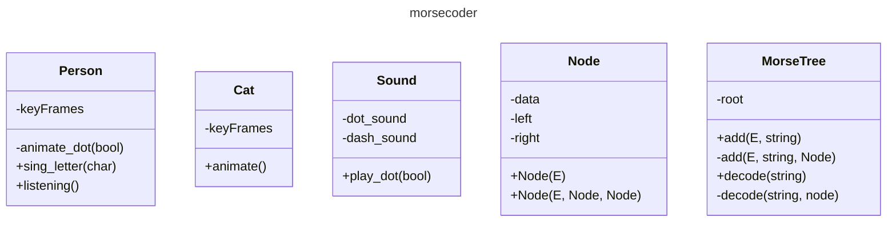
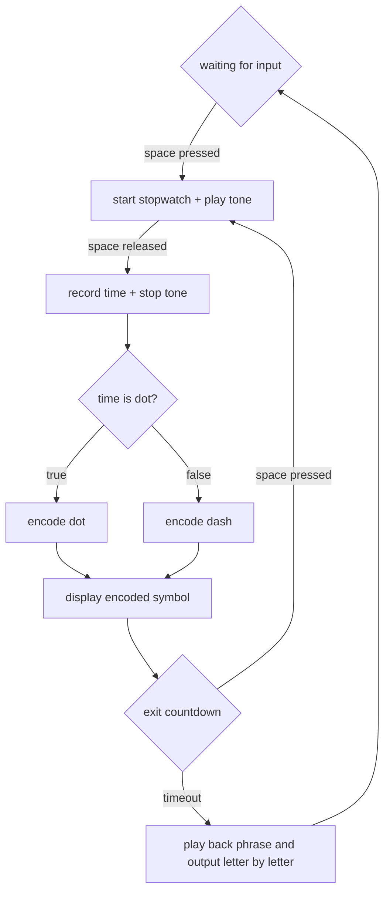

## uml

```mermaid
---
title: morsecoder
---
classDiagram

class Person {
    -keyFrames
    -animate_dot(bool)
    +sing_letter(char)
    +listening()
}

class Cat {
    -keyFrames
    +animate()
}

class Sound {
    -dot_sound
    -dash_sound
    +play_dot(bool)
}

class Node {
    -data
    -left
    -right
    +Node(E)
    +Node(E, Node, Node)
}

class MorseTree {
    -root
    +add(E, string)
    -add(E, string, Node)
    +decode(string)
    -decode(string, node)
}
```
---

## Program Flow

```mermaid
flowchart TD

sp{waiting for input} -- space pressed --> ss[start stopwatch + play tone]
ss -- space released --> sr[record time + stop tone] --> td{time is dot?} -- true --> ed[encode dot] --> D
td -- false --> eD[encode dash] --> D
D[display encoded symbol]
D --> E{exit countdown} -- space pressed -->ss
E -- timeout --> P[play back phrase and output letter by letter]
P --> sp
```

