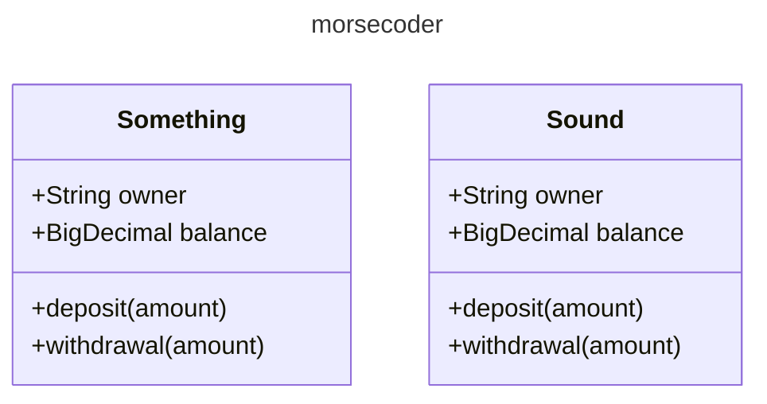
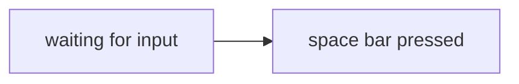

## uml

```mermaid
---
title: morsecoder
---
classDiagram

class Something {
    +String owner
    +BigDecimal balance
    +deposit(amount)
    +withdrawal(amount)
}

class Sound {
    +String owner
    +BigDecimal balance
    +deposit(amount)
    +withdrawal(amount)
}
```
---

## Program Flow

```mermaid

flowchart LR

A[waiting for input] --> B[space bar pressed]

```

